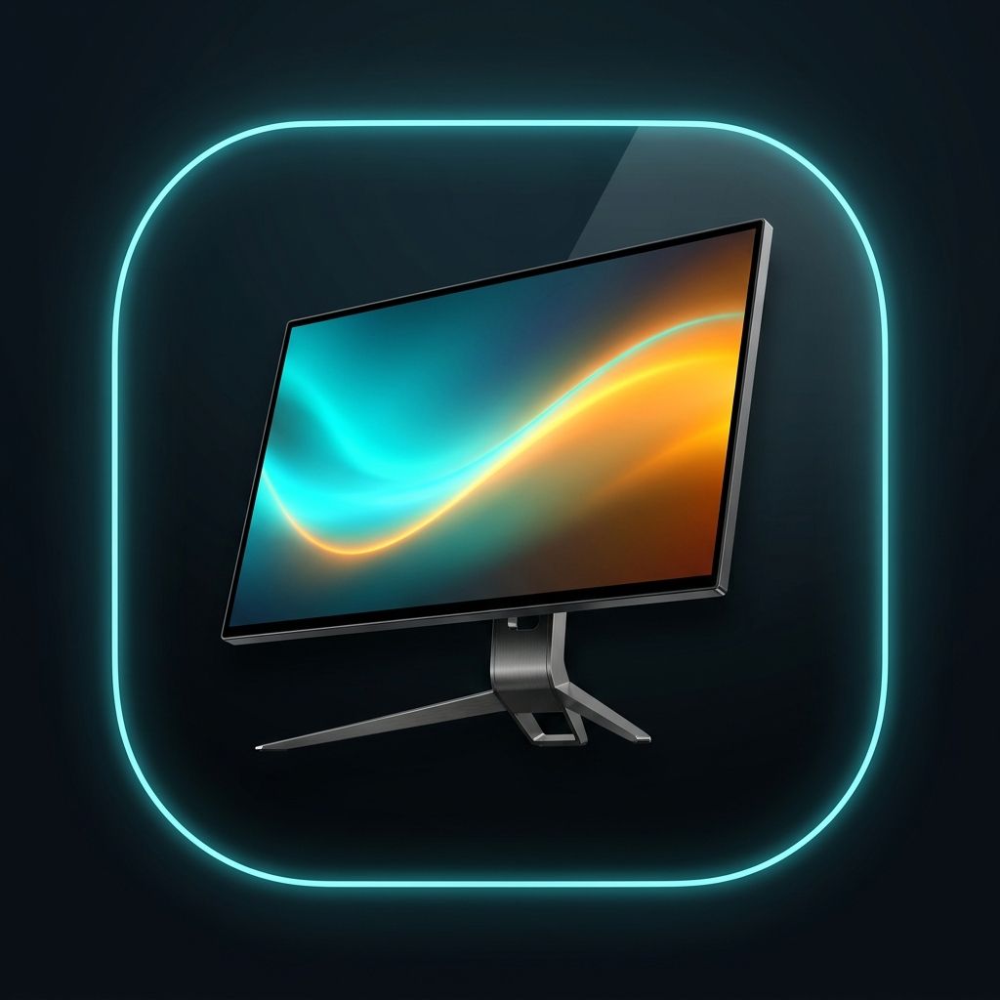
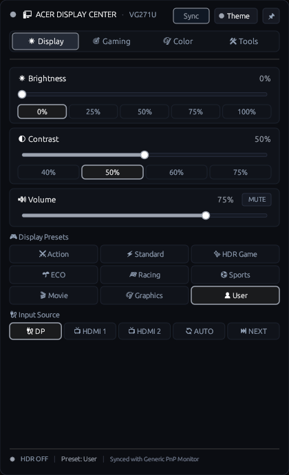
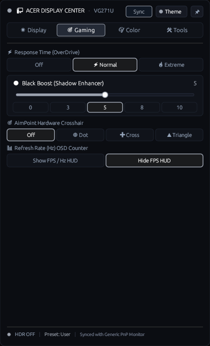
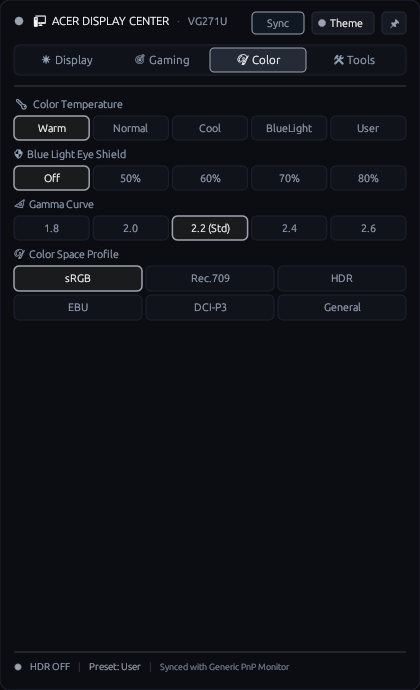
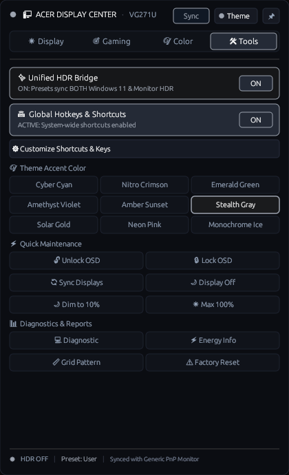
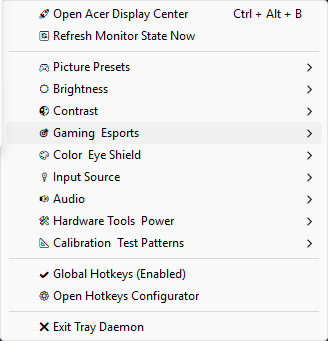

# Acer Display Center & Monitor CLI Suite (`amctl`) 🖥️⚡

[](https://www.rust-lang.org/)
[](LICENSE)
[]()
[]()

> A high-performance, pure Rust GUI & CLI suite for controlling Acer (and generic VESA MCCS) monitors via DDC/CI on Windows (AMD64 & ARM64) and Linux (x86_64, ARM64, RISC-V 64). Includes the **Acer Display Center GUI Flyout**, **Native System Tray Daemon**, **Global Hotkeys Customizer**, **Sub-Millisecond IPC Engine**, and **Automated Hardware Watchers**.

<p align="center">
  
</p>

---

## ⚡ 1-Click Instant Install

### 🪟 Windows (1-Click PowerShell)
Open PowerShell and run:
```powershell
irm https://raw.githubusercontent.com/sidhantjohnaind/acer-display-center/main/install.ps1 | iex
```
*Installs `amctl.exe` to `%LocalAppData%\Programs\acer_monitor_cli`, adds to PATH, creates Start Menu shortcut, registers Windows Startup auto-start, and immediately launches the background System Tray daemon.*

### 🐧 Linux (1-Click Shell)
Open your terminal and run:
```bash
curl -sSL https://raw.githubusercontent.com/sidhantjohnaind/acer-display-center/main/install.sh | bash
```

---

## 📋 Table of Contents

- [✨ Key Features](#-key-features)
- [🖥️ Acer Display Center GUI & System Tray Daemon](#️-acer-display-center-gui--system-tray-daemon)
- [📦 Installation & Releases](#-installation--releases)
  - [1-Click Web Install](#-1-click-instant-install)
  - [Windows Manual Install](#-windows-install)
  - [Linux AppImage & Source Install](#-linux-install)
  - [Universal Cross-Platform Tray & Widgets](#-universal-cross-platform-system-tray--quick-settings)
- [🛠️ Usage & Command Reference](#️-usage--command-reference)
  - [Display & Audio Basics](#display--audio-basics)
  - [Hardware Presets & Acer Banked VCP Controls](#hardware-presets--acer-banked-vcp-controls)
  - [Smooth Fading & Transitions](#smooth-fading--transitions)
  - [Query, Information & Diagnostics](#query-information--diagnostics)
  - [Multi-Monitor Management](#multi-monitor-management)
  - [Automation & Background Daemons](#automation--background-daemons)
- [⌨️ Keyboard Shortcuts & Global Hotkey Binding](#️-keyboard-shortcuts--global-hotkey-binding)
- [📄 License](#-license)

---

## ✨ Key Features

* **🎨 Acer Display Center GUI Flyout**: Pure Rust dark studio Quick Settings flyout (<kbd>Ctrl</kbd> + <kbd>Alt</kbd> + <kbd>M</kbd>) with live hardware sliders, smooth animated physics, visual 4×2 preset grid, eye shield toggles, and `[ 📌 Pin ]` window control (unpinned by default for natural auto-dismiss).
* **🔄 Dynamic Hardware Sync & Live Spinner**: Dynamic 2.2s sync animation with 1.5s hardware bus stabilization delay and retry backoff for 100% reliable physical DDC/CI reading.
* **🪟 Native Windows System Tray Daemon (`amctl tray`)**:
  - Low-level Win32 keyboard hook (`WH_KEYBOARD_LL`) with asynchronous DDC/CI hardware bus dispatch.
  - Cascading right-click menu with **live real-time state indicators** (`(Current: 75%)`, `● (Current)`).
  - Modern **Dark Studio Report Viewer modal** with monospace syntax formatting, screen centering, and one-click `[ 📋 Copy to Clipboard ]` button.
* **⚙️ Built-In Global Hotkeys Customizer**: Edit, add, or customize system-wide key combinations with instant JSON persistence.
* **🖥️ Full Display & Audio Control**: Adjust Brightness, Contrast, Volume, Mute, Power, and Input source (`DP`, `HDMI1`, `HDMI2`, `Auto`, `Next`).
* **🎮 Acer Hardware Banked VCPs**: Direct hardware access to Black Boost, OverDrive (`od`), AimPoint Crosshair (`aim`), Blue Light Filter (`bluelight`), Gamma, Color Temperature (`colortemp`), and Refresh Rate Counter (`refreshnum`).
* **🎛️ 8 Physical Hardware Presets**: Direct access to the monitor's 8 physical OSD modes (`action`, `standard`, `hdr`, `eco`, `racing`, `sports`, `graphics`, `user`) with EEPROM profile support.
* **✨ Unified HDR Bridge**: Seamlessly synchronizes Windows 11 OS HDR with Monitor Hardware HDR in a single atomic switch.
* **🌊 Smooth Parameter Fading**: Transition brightness, contrast, or volume smoothly over custom time durations (`fade`).
* **☀️ Solar Circadian Auto-Scheduler**: Automatically shifts display brightness and color temperature between day and night based on GPS coordinates.
* **🌙 Smart Inactivity Idle Dimmer**: Dims screen after inactivity, with automatic inhibition during media playback.
* **⚡ Sub-Millisecond IPC Socket Server**: Background server daemon (`server`) listening on local IPC for instant hotkey handling (`send`).
* **🌍 Multi-Architecture Support**: Native cross-compilation binaries for **x86_64**, **ARM64 (aarch64)**, and **RISC-V 64 (riscv64gc)**.

---

## 🖥️ Acer Display Center GUI & System Tray Daemon

### 1. Quick Access GUI Flyout (`amctl gui`)
Press **<kbd>Ctrl</kbd> + <kbd>Alt</kbd> + <kbd>M</kbd>** or left-click the System Tray icon to open the flyout:

<p align="center">
  
  
</p>
<p align="center">
  
  
</p>

- **Header Controls**: `[ 📌 Pin Window ]`, `[ 🎨 9 Accent Color Themes ]`, and `[ 🔄 Re-sync ]` with live spinning loader.
- **Display Tab**: Smooth animated Brightness, Contrast, Volume & Mute sliders, 8 Hardware Picture Presets (4×2 Grid), and Active Video Input Switcher.
- **Gaming & Esports**: Response Time OverDrive (`Extreme` / `Normal` / `Off`), Black Boost Shadow Equalizer (0–10), Hardware AimPoint Crosshairs (`Dot` / `Cross` / `Triangle`), and Refresh Rate (Hz / FPS) HUD.
- **Color & Eye Shield**: Blue Light Filter (Level 1–4), Color Temperature (Warm / Normal / Cool / BlueLight / User), Gamma Curve (1.8 / 2.0 / 2.2 / 2.4 / 2.6), Color Space (sRGB / DCI-P3 / Rec.709 / HDR / EBU / SMPTE-C).
- **Hardware & Power Tools**: Unified HDR Master Switch, Global Hotkeys Master Toggle, 9 UI Accent Themes, Physical OSD Keylock, Energy Estimator, Diagnostic Scanner, Calibration Patterns, and Factory Reset.
- **Hotkeys Customizer**: Add and rebind any hotkey directly inside the UI.

### 2. Live System Tray Context Menu (`amctl tray`)
Right-click the notification area icon for instant access to cascading hardware controls and dynamic shortcut accelerators:

<p align="center">
  
</p>

- `🚀 Open Acer Display Center` (Dynamic accelerator key binding lookup)
- `🔄 Refresh Monitor State Now`
- `🎮 Picture Presets` (Action, Racing, Sports, Standard, ECO, Graphics, HDR Game, User)
- `☀️ Brightness` (100%, 75%, 50%, 25%, 10% Night Dim, 0%, +10%, -10%)
- `🌓 Contrast` (80% down to 20%)
- `🎯 Gaming & Esports` (AimPoint Crosshairs, Toggle FPS/Hz HUD, OverDrive Extreme/Normal/Off, Black Boost 0–10)
- `🎨 Color & Eye Shield` (Blue Light Level 1–4, Color Temp, Gamma 1.8–2.6, Color Space sRGB/DCI-P3/Rec.709/HDR)
- `🔌 Input Source` (DP, HDMI 1, HDMI 2, Auto Select, Next Input)
- `🔊 Audio` (Toggle Mute, Volume 0–100%, Volume +/-10%)
- `🛠️ Hardware Tools & Power` (Unified HDR, Standby Power Off, Power LED, Solar Scheduler, Diagnostics, Calibration Patterns)
- `⚙️ Global Hotkeys` (Master Toggle & Quick Configurator)

---

## 📦 Installation & Releases

### 🚀 Direct Binary Downloads (v1.3.0)

| Platform | Architecture | Binary Package | Description |
| :--- | :--- | :--- | :--- |
| **🪟 Windows** | `x86_64` (AMD64) | [**`amctl.exe`**](https://github.com/sidhantjohnaind/acer-display-center/releases/download/v1.3.0/amctl.exe) \| [**`acer_display_center.exe`**](https://github.com/sidhantjohnaind/acer-display-center/releases/download/v1.3.0/acer_display_center.exe) \| [`acer_monitor_cli.exe`](https://github.com/sidhantjohnaind/acer-display-center/releases/download/v1.3.0/acer_monitor_cli.exe) | Complete suite: Pure GUI Subsystem Flyout, System Tray Daemon & Console CLI |
| **🐧 Linux** | `x86_64` (amd64) | [**`amctl-linux-x86_64`**](https://github.com/sidhantjohnaind/acer-display-center/releases/download/v1.3.0/amctl-linux-x86_64) | Standalone Linux x86_64 CLI & IPC Server |
| **🐧 Linux** | `aarch64` (ARM64) | [**`amctl-linux-arm64`**](https://github.com/sidhantjohnaind/acer-display-center/releases/download/v1.3.0/amctl-linux-arm64) | ARM64 Linux, Raspberry Pi 4/5, SBCs |
| **🐧 Linux** | `riscv64gc` (RISC-V 64) | [**`amctl-linux-riscv64`**](https://github.com/sidhantjohnaind/acer-display-center/releases/download/v1.3.0/amctl-linux-riscv64) | RISC-V 64-bit Linux boards & emulators |

---

### 🪟 Windows Install
Run the 1-click install command or download the latest `.exe` from [Releases](https://github.com/sidhantjohnaind/acer-display-center/releases):
```powershell
irm https://raw.githubusercontent.com/sidhantjohnaind/acer-display-center/main/install.ps1 | iex
```

### 🐧 Linux Install
```bash
curl -sSL https://raw.githubusercontent.com/sidhantjohnaind/acer-display-center/main/install.sh | bash
```

### 🐧 Linux Manual Setup (Any Distro / Architecture)
Download the binary for your architecture from [Releases](https://github.com/sidhantjohnaind/acer-display-center/releases):
```bash
# Example for x86_64 (amd64):
wget https://github.com/sidhantjohnaind/acer-display-center/releases/download/v1.3.0/amctl-linux-x86_64 -O amctl
chmod +x amctl
sudo mv amctl /usr/local/bin/

# Ensure i2c-dev module is loaded for DDC/CI hardware bus communication:
sudo modprobe i2c-dev
echo "i2c-dev" | sudo tee /etc/modules-load.d/i2c-dev.conf
sudo usermod -aG i2c $USER
```

This performs the complete Windows setup:
1. Installs `amctl.exe` & `acer_monitor_cli.exe` into `%LocalAppData%\Programs\acer_monitor_cli` and adds it to your user `PATH`.
2. Creates an **Acer Display Center** Start Menu shortcut with the custom app icon (`app.ico`).
3. Auto-registers and starts the **Pure Rust System Tray Daemon** (`amctl tray`) on Windows logon.

To launch or restart the System Tray Daemon manually:
```powershell
amctl tray
```

### 🗑️ Uninstallation

#### Windows (1-Click Uninstall):
Run `uninstall.bat` or execute in PowerShell:
```powershell
.\uninstall.ps1
```
*Stops background tray processes, unregisters Windows Scheduled Tasks and Startup items, and removes binary folders and PATH entries.*

#### Linux:
```bash
./uninstall.sh
```
*Stops systemd background services, deletes `/usr/local/bin/amctl` and `~/.local/bin` binaries, and removes desktop shortcuts and autostart entries.*


### ⚙️ Building from Source

#### 1. Prerequisites & Toolchain Setup

First, install the Rust compiler and toolchain if you haven't already:
```bash
curl --proto '=https' --tlsv1.2 -sSf https://sh.rustup.rs | sh
```

**Linux Prerequisites**:
Ensure `build-essential`, `pkg-config`, and the `i2c-dev` kernel module are installed:
```bash
sudo apt update && sudo apt install -y build-essential pkg-config
sudo modprobe i2c-dev
```

#### 2. Native Compilation

Clone the repository and build the optimized release binary:
```bash
git clone https://github.com/sidhantjohnaind/acer_monitor_cli.git
cd acer_monitor_cli
cargo build --release
```

- **Linux Output**: `target/release/acer_monitor_cli`
- **Windows Output**: `target/release/acer_monitor_cli.exe`

#### 3. Cross-Compiling for Other Architectures

You can cross-compile `acer_monitor_cli` for Linux ARM64 (Raspberry Pi), Linux RISC-V 64, and Windows on ARM:

```bash
# 🐧 Linux ARM64 / Raspberry Pi (aarch64)
sudo apt install -y gcc-aarch64-linux-gnu
rustup target add aarch64-unknown-linux-gnu
CARGO_TARGET_AARCH64_UNKNOWN_LINUX_GNU_LINKER=aarch64-linux-gnu-gcc \
cargo build --release --target aarch64-unknown-linux-gnu
# Binary: target/aarch64-unknown-linux-gnu/release/acer_monitor_cli

# 🧪 Linux RISC-V 64 (riscv64gc)
sudo apt install -y gcc-riscv64-linux-gnu
rustup target add riscv64gc-unknown-linux-gnu
CARGO_TARGET_RISCV64GC_UNKNOWN_LINUX_GNU_LINKER=riscv64-linux-gnu-gcc \
cargo build --release --target riscv64gc-unknown-linux-gnu
# Binary: target/riscv64gc-unknown-linux-gnu/release/acer_monitor_cli

# 🪟 Windows x86_64 (from Linux)
sudo apt install -y mingw-w64
rustup target add x86_64-pc-windows-gnu
cargo build --release --target x86_64-pc-windows-gnu
# Binary: target/x86_64-pc-windows-gnu/release/acer_monitor_cli.exe

# 💻 Windows on ARM / Snapdragon X Elite (ARM64)
rustup target add aarch64-pc-windows-msvc
cargo build --release --target aarch64-pc-windows-msvc
# Binary: target/aarch64-pc-windows-msvc/release/acer_monitor_cli.exe
```

---

## 🧩 Universal Cross-Platform System Tray & Quick Settings

`amctl` includes a universal, pure Rust System Tray and Quick Settings GUI that works seamlessly across **Windows**, **Linux** (KDE, GNOME, XFCE, Cinnamon, Sway, Hyprland, Waybar), and other desktop environments:

1. **Universal StatusNotifierItem / System Tray (`amctl tray`)**:
   - Native notification area icon across Windows & Linux with live cascading menus for Brightness, Presets, Inputs, HDR toggle, and Quick Settings.
   - Zero external runtime library dependencies (100% pure Rust DBus / Win32).

2. **Frame Studio Quick Settings GUI (`amctl gui`)**:
   - Sleek dark mode hardware control center with 9 accent color themes, hardware OSD keylock, live sensor graphs, and calibration test patterns.

3. **Rofi / Dmenu Quick Launcher Widget** (`rofi-acer.sh`):
   - Fast keyboard-driven menu for i3, Sway, Hyprland, XFCE, and Openbox window managers.
   - Launch anytime with `./rofi-acer.sh`.

4. **Waybar Status Bar Widget** (`waybar/`):
   - Custom widget configuration (`config.jsonc`) and glassmorphic CSS (`style.css`) for Hyprland/Sway bars.


---

## 🛠️ Usage & Command Reference

You can use `amctl`, `amc`, or `acer_monitor_cli` interchangeably.

### Display & Audio Basics

```bash
amctl brightness 80            # Set brightness to 80%
amctl brightness +10 --osd     # Increase brightness by 10% with visual OSD banner
amctl contrast 75              # Set contrast to 75%
amctl volume 50                # Set volume to 50%
amctl volume -5 --osd          # Decrease volume by 5% with OSD banner
amctl mute toggle --osd        # Toggle mute/unmute with OSD banner
amctl input next               # Cycle to the next input channel
amctl input dp                 # Switch directly to DisplayPort (dp, hdmi1, hdmi2, auto)
amctl power off                # Turn off monitor display power (on | off)
```

### Hardware Presets & Acer Banked VCP Controls

```bash
amctl preset hdr               # Apply hardware HDR mode (user, standard, eco, graphics, action, racing, sports, hdr, reading, movie)
amctl blackboost 5             # Adjust Black Boost level (0-10)
amctl bluelight 70             # Set Blue Light filter (0, 50, 60, 70, 80)
amctl colortemp warm           # Set color temperature (warm, normal, cool, bluelight, user)
amctl gamma 22                 # Set gamma level (18, 20, 22, 24, 26)
amctl od 2                     # Set OverDrive level (0=Off, 1=Normal, 2=Extreme)
amctl aim 1                    # Set AimPoint crosshair overlay type (0=Off, 1-3=Crosshair style)
amctl refreshnum on            # Enable hardware refresh rate counter OSD (on | off)
amctl indicator off            # Turn off front power LED indicator (on | off)
amctl keylock on               # Lock front panel OSD buttons (on | off)
amctl unlock                   # Emergency unlock OSD buttons and power button
amctl reset                    # Factory reset monitor settings
```

### 🎨 Hardware RGB Gain & Color Calibration

Directly inspect and control the physical Red (`0x16`), Green (`0x18`), and Blue (`0x1A`) hardware gain registers:

```bash
amctl gain                     # Read current Red, Green, and Blue gain levels
amctl gain red 75              # Set Red gain to 75%
amctl gain green 50            # Set Green gain to 50%
amctl gain blue 50             # Set Blue gain to 50%
amctl gain 50 50 50            # Set R G B levels in a single atomic command
amctl gain reset               # Reset hardware RGB Gain back to neutral (50 / 50 / 50)
amctl bias red 50              # Set Red Bias (Black Level) (0x6C)
```

### 🕵️ Interactive VCP Register Change Recorder

Discover and map unknown hardware features on **any monitor** by comparing snapshots before and after changing physical OSD settings:

```bash
amctl record                   # Take baseline snapshot, change OSD on monitor, press Enter to diff
```

### Smooth Fading & Transitions

Fades brightness, contrast, or volume smoothly from a starting value to an ending value over a specified duration in milliseconds (default: 1000ms):

```bash
amctl fade brightness 10 90 2000    # Fade brightness from 10% to 90% over 2 seconds
amctl fade volume 80 10 1500        # Fade volume from 80% down to 10% over 1.5 seconds
```

### Query, Information & Diagnostics

```bash
amctl list                     # List connected DDC/CI monitors
amctl list --json              # Output monitor list in JSON format
amctl info                     # Print detailed capabilities and current VCP values
amctl info --json              # Output detailed monitor info as JSON
amctl caps                     # Display raw MCCS capability string report
amctl scan                     # Probe common VCP feature codes
amctl scan --json              # Output probe scan results as JSON
amctl watch-vcp                # Watch and detect real-time VCP code value changes (for any Acer or generic/non-Acer monitor)
amctl watch-vcp 0x10 0x12 0x60 # Watch specific VCP codes in real-time
amctl watch-vcp --all          # Probe and monitor all 256 VCP codes (0x00-0xFF)
amctl watch-vcp --json         # Stream real-time VCP change events in JSON
amctl edid                     # Display hardware EDID panel readout
amctl diag                     # Generate a full system diagnostic report
amctl energy                   # Estimate current wattage draw and annual energy cost
amctl test-pattern gradient    # Render diagnostic test pattern (red, green, blue, white, black, grid, gradient)
amctl get 0x10                 # Read raw VCP code (e.g. 0x10 = Brightness)
amctl get-bluelight            # Get current Blue Light level
amctl get-gamma                # Get current Gamma level
amctl get-colortemp            # Get current Color Temp
amctl get-od                   # Get current OverDrive level
amctl get-blackboost           # Get current Black Boost level
```

### Multi-Monitor Management

Pass a monitor specifier at the end of any command to target specific displays:
- **By Index**: `0`, `1`, etc.
- **By Model Substring**: `VG271U`, `Nitro`, etc.
- **All Monitors**: `all`

```bash
amctl brightness 100 0         # Set brightness of monitor 0 to 100%
amctl preset eco VG271U        # Apply ECO preset to monitor matching 'VG271U'
amctl brightness 50 all        # Set brightness to 50% across ALL monitors
amctl sync                     # Sync secondary monitors' brightness & contrast to master monitor
amctl balance --offset -15     # Balance secondary monitors with relative offset to master display
```

### Automation & Background Daemons

```bash
# Solar circadian schedule based on latitude/longitude coordinates
amctl solar-schedule --lat 28.61 --lon 77.20 --day-b 90 --night-b 15 --night-ct warm

# Smart Idle Dimmer (dims display after 5 mins idle, pauses dimming when watching video via MPRIS)
amctl idle-dimmer --idle-secs 300 --dim-to 10

# Auto-Profile Switcher (applies profile JSON when process is active)
amctl auto-profile --rule "hl2.exe:gaming.json"

# Hotplug Monitor Watcher (detects display connection changes)
amctl watch-monitors

# System Tray Application (runs in notification area next to clock)
amctl tray

# IPC Server Daemon (runs IPC socket server for sub-millisecond hotkey commands)
amctl server
amctl send brightness +10      # Send command to active server daemon
```

### Profile Management

Save monitor settings to JSON configuration files and restore them at any time:

```bash
amctl profile save workspace.json    # Save current monitor settings to JSON
amctl profile load workspace.json    # Restore settings from JSON file
```

### Shell & Status Bar Integration

```bash
# Output Waybar configuration block
amctl waybar-config

# Generate shell completion script
amctl completions bash > /etc/bash_completion.d/amctl
amctl completions zsh > ~/.zsh/completion/_amctl
amctl completions fish > ~/.config/fish/completions/amctl.fish
```

---

## ⚡ Advanced: Raw Banked VCP Control

Acer hardware utilizes custom banked register mapping over VCP codes `0xE0`, `0xE7`, and `0xE9`. Advanced users can directly read or write banked registers:

```bash
# Write selector register and set bank value
amctl rawbank e0 0x04 2        # Write OverDrive selector (0x04) = 2 (Extreme)

# Read banked register selector value
amctl getbank e7 0x00          # Read Blue Light selector (0x00)
```

---

## ⌨️ Keyboard Shortcuts & Global Hotkey Binding

You can bind `amctl` commands to global hotkeys on Linux and Windows for instant display control:

### ⚡ Ultra-Fast Sub-Millisecond Hotkeys (via IPC Daemon)

Run the background IPC server (`amctl server` or `systemctl --user enable --now acer-monitor`) and bind hotkeys to `amctl send`:
- `amctl send brightness +10` (Bypasses DDC query overhead for sub-millisecond execution)
- `amctl send brightness -10`

### 🐧 Linux (Hyprland / Sway / i3 / WM)

Add to `hyprland.conf`:
```ini
# Brightness Hotkeys
bind = Super+Alt, Up, exec, amctl brightness +10 --osd
bind = Super+Alt, Down, exec, amctl brightness -10 --osd

# Preset & Rofi Quick Menu
bind = Super+Alt, H, exec, amctl preset hdr
bind = Super+Alt, E, exec, amctl preset eco
bind = Super+Alt, Space, exec, ./rofi-acer.sh
```

Add to `sway/config` or `i3/config`:
```ini
bindsym Mod4+Mod1+Up exec amctl brightness +10 --osd
bindsym Mod4+Mod1+Down exec amctl brightness -10 --osd
bindsym Mod4+Mod1+space exec ./rofi-acer.sh
```

### 🐧 Linux (GNOME / Ubuntu / KDE Plasma)

Open **Settings -> Keyboard -> Keyboard Shortcuts -> Custom Shortcuts**:
- **Name**: `Acer Brightness Up` | **Command**: `amctl brightness +10 --osd` | **Shortcut**: `Super+Alt+Up`
- **Name**: `Acer Brightness Down` | **Command**: `amctl brightness -10 --osd` | **Shortcut**: `Super+Alt+Down`
- **Name**: `Acer HDR Mode` | **Command**: `amctl preset hdr` | **Shortcut**: `Super+Alt+H`

### 🪟 Windows (AutoHotkey Script)

Use the included [`amctl.ahk`](file:///home/sidhant-aind/Projects/acer_monitor_cli_impl/amctl.ahk) AutoHotkey script:
```autohotkey
#!Up::Run, acer_monitor_cli.exe brightness +10 --osd, , Hide
#!Down::Run, acer_monitor_cli.exe brightness -10 --osd, , Hide
#!h::Run, acer_monitor_cli.exe preset hdr, , Hide
#!e::Run, acer_monitor_cli.exe preset eco, , Hide
```

---

## 🗑️ Uninstallation

To completely remove `amctl`, background daemons, desktop entries, and GNOME extensions:

### Linux / macOS
```bash
./uninstall.sh
```

### Windows (PowerShell)
```powershell
.\uninstall.ps1
```

---

## 📄 License

Licensed under the [MIT License](LICENSE).


